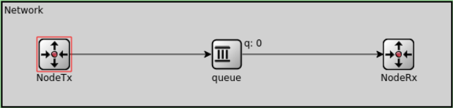
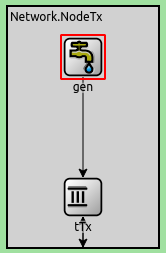
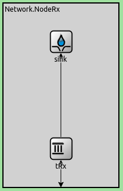
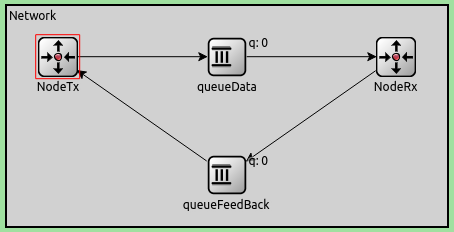

# Análisis de flujo y congestión en redes utilizando simulación discreta

Gómez Vera Eleonora Constanza - Gabriel Guimpelevich - Valentín Fantini

## Abstract
Mediante el uso de simulaciones discretas en OMNET++ se estudian los efectos de un simple algoritmo control de flujo y congestión en una red, tanto en eficacia como en calidad de conexión respecto a los paquetes enviados/perdidos. Mediante la limitación de paquetes en simultáneo que se envían se puede lograr una solución que, aunque primitiva, resulta eficaz.

# Introducción

Se busca estudiar las diferencias de flujo (datos pasando por la red) y de congestión (cuando la red se satura) usando diferentes métodos de control de estos. El Control de Flujo se encarga de solucionar el problema de cuando el transmisor envía demasiada información a un receptor de baja capacidad, esto significa que llegan los datos más rápido de lo que el receptor los puede procesar. El Control de Congestión se encarga de solucionar el problema de cuando el emisor excede la capacidad de transporte interno de la red. Por lo tanto, este se encarga de controlar la carga interna de la red.

# Simulaciones

Nuestra red consta de un “generador” (NodeTx) y un “receptor” (NodeRx), los cuales están conectados a través de un nodo intermedio “Queue”. Esto es un modelo de colas.

 

- **NodeTx:** Consta de un generador y una cola. El generador va creando paquetes cada cierto tiempo y la cola va enviando estos paquetes a medida que puede. Cuando no puede los almacena a forma de buffer hasta poder enviarlos.

- **NodeRx:** Tiene un consumidor y una cola. El consumidor consume los paquetes cada cierto tiempo y la cola va recibiendo estos paquetes y los almacena a modo de buffer hasta que el consumidor los consuma. Cuando el buffer esté lleno los nuevos que entren serán descartados.

- **Queue:** Cola intermedia. Recibe los paquetes de entrada y los envía al receptor a medida que puede. Almacena los paquetes que llegan más rápido de lo que puede enviar. Cuando se satura se descartan los nuevos paquetes que van llegando. 

En este trabajo vamos a estudiar dos casos sobre el mismo modelo, en los que varían las tasas de transferencia entre nodos. 

### Caso de estudio 1:
- **NodeTx --> Queue:** datarate=1Mbps | delay=100us
- **Queue --> NodeRx:** datarate=1Mbps | delay=100us
- **NodeRx --> Sink:**    datarate=0.5Mbps

### Caso de estudio 2:
- **NodeTx --> Queue:** datarate=1Mbps | delay=100us
- **Queue --> NodeRx:** datarate=0.5Mbps | delay=100us
- **NodeRx --> Sink:** datarate=1Mbps

Durante los análisis se simulará durante un tiempo de 200s, tamaños de paquete de 12500bytes cada uno, capacidad de 200 paquetes tanto para el Queue de la red como para el buffer de NodeRx y capacidad de 2.000.000 paquetes para el buffer de NodeTx.

Para cada uno de los casos vamos a variar el intervalo de generación de paquetes para estudiar cómo se comporta cada modelo de red en dichas situaciones.

## Caso de estudio 1:

### Intervalo de generación 0.1:

Del gráfico podemos observar que la cantidad de paquetes recibidos por el receptor aumenta de manera lineal hasta saturarse cuando la cantidad de paquetes es 200. Esto quiere decir que todos los paquetes perdidos por la saturación de los buffers ocurre en el receptor.
Dicha saturación se produce porque el receptor recibe paquetes a una velocidad aproximada de 1 Mbps mientras que su capacidad de salida es de 0.5 Mbps, generando un cuello de botella.

### Intervalo de generación 0.3:

### Intervalo de generación 1:

Se puede ver que cuando el intervalo de generación es 1 los paquetes llegan lo suficientemente lento como para que haya un solo paquete en cada queue en promedio (nótese que al aumentar el intervalo de generación, la tasa de generación de paquetes es menor). Nunca se llegan a llenar los buffers, dado que la velocidad de transferencia es suficiente para transmitir los paquetes a medida que llegan.

Entonces, según los datos observados podemos concluir que el problema a resolver es cuando el intervalo de generación es aproximadamente menor o igual a 0.1, ocurriendo un problema de control de flujo.

## Caso de estudio 2:

### Intervalo de generación 0.1:

En este caso podemos observar que lo que se satura es la cola intermedia porque recibe paquetes a una velocidad que no puede manejar y por ende estos se pierden porque nunca llegan al receptor. La cola intermedia recibe de NodeTx a 1Mbps, pero sólo le puede enviar 0,5Mbps a NodeRx, haciendo que reciba 0,5Mbps más de lo que puede transmitir hacia adelante, llenando así su capacidad de buffer. 

### Intervalo de generación 0.3:

### Intervalo de generación 1:

De la misma manera que el caso anterior, al disminuir el intervalo de generación, aumentamos la cantidad de paquetes enviados. Por lo que el problema a solucionar es cuando el intervalo de generación es muy pequeño (en este caso menor o igual a 0.1). Debido a que el cuello de botella que provoca los paquetes perdidos se genera en la red: es un problema de control de congestión. 

## Gráfico de Delay

En este gráfico tenemos el delay tanto del caso 1 como del caso 2 ya que las gráficas se superponen. Podemos observar que desde el tiempo 0 hasta que ocurre la saturación el delay avanza de manera lineal porque la cola se va llenando de a poco y luego se mantiene en un intervalo casi fijo porque se alcanza el maximo de paquetes que se pueden tener en la cola. Entonces si hay 200 en la cola cada uno se puede demorar el tiempo de 199 paquetes de en frente.

## ¿Cuántos paquetes se pierden en total?
Si hacemos un gráfico que relaciona la cantidad de paquetes enviados, la cantidad de paquetes recibidos y la cantidad de paquetes eliminados  en función del tiempo obtenemos: 

El grafico es el mismo para ambos casos. El eje x corresponde al tiempo, mientras que el eje y corresponde a la cantidad de paquetes.  

Entonces se observa que tanto en el caso 1 como en el caso 2 se produce la misma pérdida de paquetes debido a que en ambos casos existe un cuello de botella, sólo que en diferentes lugares. En el caso 1 se llena el buffer de NodeRx y en el caso 2 se llena el buffer de la cola intermedia. Por esto es necesario solucionar tanto el problema de flujo como el problema de congestión.

# Métodos:
Para intentar solucionar esto proponemos un algoritmo de parada y espera, es decir, los paquetes generados se quedan esperando en una cola "Infinita" (en NodeTx) que deja pasar de a un paquete a la vez. Esta no envía el siguiente paquete hasta que no reciba un feedback desde NodeRx avisando que el anterior llegó.

Implementamos una nueva cola que se encarga de dirigir por otra ruta únicamente los paquetes de feedback. Estos paquetes de feedback son los que usan los Nodos para comunicarse entre sí, particularmente las colas tTx de NodeTx y tRx de NodeRx, en donde la primera recibe de esta última la confirmación de cuándo puede mandar el siguiente paquete.

De esta manera pretendemos solucionar el problema de la congestión y el de flujo, haciendo que no se manden más paquetes de lo que la red soporta, particularmente, sólo se enviará un paquete a la vez. Esto es porque cada paquete que envía el generador es almacenado sin limite de tiempo en la cola "infinita" hasta que sea su turno de pasar, asegurando así la integridad de todos los paquetes.

 

# Resultados

Luego de la implementación del algoritmo, ejecutamos el código para el caso 1 y caso 2 con los siguientes resultados:

## Caso de estudio 1:
### Intervalo de generación 0.1:

.png)

Podemos observar que la cantidad de paquetes en buffer de NodeTx aumenta linealmente, el buffer de NodeRx se mantiene en 0 porque no es necesario almacenar paquetes ya que solo le llega uno y lo envia apenas es recibido. El buffer de la queueData va recibiendo un paquete y lo envia apenas los recibe asi que va alternando entre 0 y 1. Esto se ve mas claramente el siguiente grafico que es un acercamiento del anterior.

.png)

Observamos como las funciones de paquetes enviados al consumidor y paquetes recibidos se superponen, ya que nuestro protocolo no pierde paquetes en el medio de el recorrido hacia el consumidor, por eso los paquetes eliminados se mantienen en 0. Esto es realizado gracias la cola "infinita" que almacena todos los paquetes que recibe del generador, por esto la funcion de paquetes a enviar es mucho mayor que los paquetes se terminan enviando realmente en el tiempo que dura la simulacion.

### Intervalo de generación 0.3:

.png)

.png)

Cuando aumentamos el intérvalo de generación observamos un comportamiento idéntico al anterior observado, ya que estamos enviando menos paquetes, pero el comportamiento de parada y espera es exactamente el mismo. 

## Caso de estudio 2:

### Intervalo de generación 0.1:

.png)

.png)

En el caso de estudio 2 observamos un comportamiento similar. Las gráficas de paquetes enviados y recibidos se superponen, no existen paquetes eliminados. Si bien la cantidad de paquetes enviados es mayor en el caso 1, por lo tanto para este caso también se tienen menos paquetes en el buffer. Esto se debe a que en el caso 1 hay mayor tasa de transferencia hacia en el receptor. 

### Intervalo de generación 0.3:

.png)

.png)

## Intervalos de generación más grandes:

Cuando el intervalo de generación es más grande las líneas de ambos gráficos (de paquetes en buffer y de paquetes recibidos/enviados/eliminados) simplemente se aplanan, pero el comportamiento es similar. No se llega a concluir nueva información a partir de gráficos con intervalos más grandes que los presentados.

## Gráfico de Delay

### Caso de estudio 1:

### Caso de estudio 2:

Se puede ver que ambos graficos (Caso1 y Caso2) son bastante parecidos, lo que cambia es lo que comentamos previamente que el algoritmo envia paquetes "mas rapido" en el caso 1, por nuestra implementacion. El grafico muestra el delay que le toma a un paquete de viajar desde el productor cuando el delay setea, hasta llegar al consumidor que lo registra. En base a lo observado notamos que en nuestra implementacion el delay aumenta casi linealmente a medida que pasa el tiempo, esto debido a que todos los paquetes se van acumulando en la cola tTx esperando a poder ser mandados, ya que nuestro algoritmo no prioriza la rapidez sino que todos los paquetes terminen llegando en algun momento.

## Gráfico de Carga Útil vs Caudal Ofrecido

Se puede ver que el Caso 1 y 2 de la Parte 1 crecen linealmente hasta cierto punto en el que se produce un cuello de botella debido a que se producen paquetes más rápido de lo que lo pueden mandar.

En cambio, para la parte 2 los casos 1 y 2 son menos eficientes para poder solucionar la perdida de paquetes, por eso crecen mucho mas lento que la linea de la parte 1, la cual no tenía tantas restricciones. 

El caso 1 aumenta más que el caso 2 porque la velocidad de llegada del paquete a NodeRx es más rápida, y como los feedbacks se mandan desde ahí entonces se envían paquetes de feedback más rapido también, lo que permite un flujo más grande de paquetes de datos.

# Discusión

El algoritmo propuesto se basa en poder eliminar el problema de perder paquetes en la red. Al mandar un paquete por vez, garantizamos que ningún paquete se pierde por sobresaturación de la red, o del receptor (solucionamos problema de congestión y de flujo a la vez). Sin embargo, este algoritmo es muy poco eficiente en relación a la cantidad de paquetes que puede procesar la red por segundo. 

**Posibles falencias/formas de mejorar el algoritmo:**

- Poder consultarle al receptor el tamaño del buffer para saber qué cantidad de paquetes enviar, con lo que aumentaremos la cantidad de paquetes enviados por segundo sin sobresaturar la red o el receptor. Este tipo de información puede ser enviada a través del paquete de feedback que se manda actualmente. Nuestro algoritmo actual envía un mensaje sin información, el cual al ser recibido es una confirmación de que podemos enviar el siguiente paquete. Si dotamos a este mensaje de información podemos obtener datos importantes como el estado del buffer del receptor, de la cola intermedia, su tamaño máximo, etc. 

- Manejar la perdida de paquetes de feedback con el uso de temporizadores, por ejemplo.

- La queue tTx del NodeTx solo es infinita teoricamente, en realidad unicamente es de un tamaño muy grande. Esto significa que en algun momento esta se podria llenar.

- El feedback no se manda cuando el paquete de datos llega al sink, sino que cuando llega a NodeRx. Esto podría provocar fallos si el paquete de datos está en viaje hacia el sink y ya le llega un nuevo paquete a NodeRx, haciendo que quiera mandar dos paquetes a la vez. O si el paquete de feedback llega muy rápido podría provocar problemas incluso llenando la cola intermedia. En nuestra implementación la velocidad de el paquete de feedback es lo suficientemente lenta como para que no cause problemas, esto debe ser tomado en cuenta a la hora de cualquier futura implementación del algoritmo.

## Referencias

- Tanenbaum. Computer Networks: quinta edición. 2011

- Documentación de Omnet++
