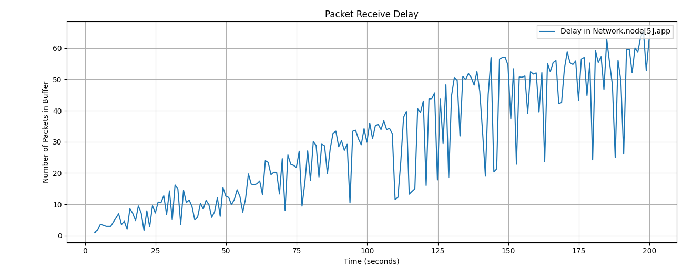

# Laboratorio 4 Redes y Sistemas Distribuidos
Constanza Gomez - Gabriel Guimpelevich - Valentin Fantini

## Abstract

[//]: # (TODO)

## Tabla de Contenidos
- [Laboratorio 4 Redes y Sistemas Distribuidos](#laboratorio-4-redes-y-sistemas-distribuidos)
  - [Abstract](#abstract)
  - [Tabla de Contenidos](#tabla-de-contenidos)
- [Introduccion](#introduccion)
    - [Caso de prueba 1](#caso-de-prueba-1)
    - [Caso de prueba 2](#caso-de-prueba-2)
  - [Pruebas iniciales](#pruebas-iniciales)
    - [Caso 1](#caso-1)
    - [Caso 2](#caso-2)
      - [Mayor Intervalo de llegada de Paquetes](#mayor-intervalo-de-llegada-de-paquetes)
- [Propuestas e Implementacion](#propuestas-e-implementacion)
  - [Pruebas con el algoritmo](#pruebas-con-el-algoritmo)
    - [Caso 1](#caso-1-1)
    - [Caso 2](#caso-2-1)
- [Conclusiones y posibles mejoras](#conclusiones-y-posibles-mejoras)
- [Tarea Estrella](#tarea-estrella)
  - [Algoritmo generico para una red de forma desconocida](#algoritmo-generico-para-una-red-de-forma-desconocida)
    - [Grafico de Paquetes recibidos vs Paquetes enviados](#grafico-de-paquetes-recibidos-vs-paquetes-enviados)
  - [Conclusion](#conclusion)

# Introduccion
Para este Laboratorio situado en la capa de Red, vamos a simular una conexion en anillo de 8 nodos (`node[n]` donde n es un numero del 0 al 7) por los cuales se enviaran paquetes en dos casos de prueba diferentes. 

Cada nodo tendra una aplicacion `app` asociada para que cree o reciba paquetes, una network `net` para que redireccione paquetes a donde deben ir, ya sea su `app` o a otros nodos, usando dos interfaces `lnk[0]` y `lnk[1]` las cuales se conectan al nodo ubicado en sentido horario y anti-horario respectivamente. Cabe destacar que el algoritmo inicial siempre elige el sentido horario (`lnk[0]`) independientemente de la situacion.

Tambien cabe aclarar que los siguientes parametros se mantienen iguales para todos los nodos en ambos casos de prueba a menos que se especifique lo contrario:
  - `packetByteSize = 125000`: El tamaño de cada paquete en bytes, 125KB.
  - `interArrivalTime = exponential(1)`: El intervalo en el que cada paquete se envia desde la aplicacion.

### Caso de prueba 1
El `node[0]` y el `node[2]` generaran paquetes y ambos los transmitiran hacia el `node[5]`, el resto de nodos serviran solo como transporte para hacer que los paquetes lleguen hasta el nodo 5.

### Caso de prueba 2
Los nodos 0,1,2,3,4,6,7 generaran paquetes los cuales van a ir todos hacia el `node[5]`.

## Pruebas iniciales
Para realizar estas pruebas se corrieron simulaciones en Omnet++, un simulador de eventos discretos de redes, durante 200 segundos. Otra cosa que nos gustaria recalcar es que como **la red siempre favorece mandar paquetes en sentido horario** del anillo, algunas veces puede no elegir el camino mas corto. Esto se nota viendo la *maxima cantidad de saltos entre nodos de un paquete* (cuantos nodos paso el paquete antes de llegar a destino).

### Caso 1

En este caso solo los nodos 0 y 2 van a estar produciendo paquetes para `node[5]`.

Podemos observar que en el caso de nodos *de paso* como el 1, el buffer esta constantemente despachando paquetes apenas llegan, por eso el grafico es como en forma de "sierra" oscilando entre 0 y 1.
![Buffer Size in node[1]](./Graficos/P1C1/BufferSize_node1_lnk0.png)

Para orientacion aqui la ilustracion de la red en funcionamiento. Las lineas azules representan los paquetes en camino generados por `node[2]` y las lineas rojas los de `node[0]`.

Y de hecho, todos los graficos del tamaño de buffer de estos nodos "de paso" son iguales al de `node[1]`. El problema viene cuando vemos a un nodo que esta **produciendo paquetes**, por ejemplo en `node[2]`:

![Buffer Size in node[2]](./Graficos/P1C1/BufferSize_node2_lnk0.png)

En este grafico se puede ver como la produccion de paquetes afecta al buffer del nodo 2, llegando hasta a 10 paquetes retenidos en la cola para mandarlos cuando se pueda. Sin embargo, el mayor exponente de esta crecida de buffer es `node[0]`, el cual no solo produce paquetes como el nodo 2, sino que tambien *recibe* los de este ultimo y *debe redirigirlos* hacia el nodo 5.

![Buffer Size in node[0]](./Graficos/P1C1/BufferSize_node0_lnk0.png)

En este grafico se puede ver como la cantidad de paquetes es tanta que el tamaño de buffer crece de manera practicamente lineal. 

Esta manera en la cual crece el buffer de `node[0]` corresponde con el delay de los paquetes recibidos, el cual va creciendo de manera analoga:

*Delay Promedio: 51.1592s*

La maxima cantidad de saltos de un pquete es 5. Este numero se corresponde a el nodo 2 que en lugar de tomar el camino corto hacia el 5 por el camino *anti-horario* se da toda la vuelta pasando por los nodos 1,0,7,6 para finalmente llegar al 5.

Otra estadistica importante es que debido a estos bufferes sobresaturados, de los aproximadamente ~370 paquetes que **cada nodo** genera, solo llegan unos 200 al nodo 5. Eso es casi un 70% de paquetes que se pierden/atascados en bufferes.

###  Caso 2

En este caso todos los nodos *excepto `node[5]`* van a producir paquetes para enviarselos a este ultimo.

Con esta configuracion el problema de los bufferes reteniendo muchos paquetes es *aun peor*, como se podria esperar al aumentar la cantidad de productores de paquetes.

![Buffer Size in node[0]](./Graficos/P1C2/BufferSize_node0_lnk0.png)

![Buffer Size in node[3]](./Graficos/P1C2/BufferSize_node3_lnk0.png)

![Buffer Size in node[7]](./Graficos/P1C2/BufferSize_node7_lnk0.png)

Ahora todos los nodos tienen el mismo problema del buffer de paquetes a enviar creciendo cada vez mas a medida pasa el tiempo y mas paquetes se van creando por medio de sus respectivas `app`. Esto es asi **exceptuando a `node[4]`**:

![Buffer Size in node[4]](./Graficos/P1C2/BufferSize_node4_lnk0.png)

Este es un grafico que recuerda mucho al de `node[2]` en el Caso 1... Para entender mejor esto visualicemos la red:

El nodo 4 esta en una situacion muy parecida a la que estaba el nodo 2 en el Caso 1; solo esta produciendo paquetes y *no necesita redireccionar ninguno ajeno*. De esta manera su buffer de envio de paquetes solo necesita despachar *sus propios paquetes*, siendo totalmente capaz sin la necesidad de retener una enorme cantidad de paquetes.

En este caso a pesar parecer erratica, la funcion de delay tambien va creciendo de manera predecible. Tambien crece a un ritmo mas rapido que la del Caso 1, con un delay promedio de 64.5329s contra los 51.1592s del caso anterior.

Viendo la ilustracion de la red con los paquetes enviandose, el desaprovechamiento de la red debido a elegir siempre el sentido horario de enviar paquetes (`lnk[0]`) es aun mas doloroso siendo el maximo de nodos recorridos por un paquete igual a **7**. Estos son claramente los paquetes que produce el nodo 4, los cuales podrian facilmente llegar a destino con **1** solo salto.

En este caso como la cantidad de nodos productores es mucho mayor, tomando en cuenta que aproximadamente cada nodo genera ~370 paquetes, **solo unos 200 paquetes llegan**. Un numero de paquetes recibidos igual que en el caso 1 *pero con 5 productores mas*. Esto representa **casi un 90% de paquetes que se pierden/estan atascados en bufferes**.

#### Mayor Intervalo de llegada de Paquetes

Al subir el *intervalo de llegada de paquetes* a `interArrivalTime = exponential(5)` (esto significa que habran menos paquetes activos en la red en un tiempo dado) se puede ver mejor una propiedad de este tipo de envio:

![Buffer Size in node[4]](./Graficos/P1C2/LessPackets/BufferSize_node4_lnk0.png)

![Buffer Size in node[0]](./Graficos/P1C2/LessPackets/BufferSize_node0_lnk0.png)

![Buffer Size in node[7]](./Graficos/P1C2/LessPackets/BufferSize_node7_lnk0.png)

Mientras mas se alejen los nodos del principio de la cadena (`node[4]`) cada vez mas paquetes se van a amontonar debido a que cuando pasas tus paquetes a otro nodo para que los redireccione, ese nodo tambien *produce y redirecciona por el mismo lado sus propios paquetes*. Por eso se puede ver que siguiendo el orden 4-3-2-1-0-7-6-5 los bufferes cada vez estan mas saturados.

En terminos de delay, el crecimiento tiene la misma naturaleza que con el anterior `interArrivalTime`, pero con menos delay en total debido a la tambien menor cantidad de paquetes en la red.

*Delay Promedio: 29.9260s*

# Propuestas e Implementacion

El principal problema que queremos tratar es el de que no se elige un camino adecuado para mandar los paquetes dependiendo de la situacion de cada nodo, asi que el algoritmo que proponemos tiene eso en cuenta y se busca ver cuanto mejora la red tratando de hacer que los paquetes se envien por el camino con distancia mas corta.

Primero se genera un *paquete `hello`* que viaja en sentido horario contando la cantidad de saltos (o *hops*) que hizo hasta que llega al destino. Como estamos en una red en anillo, si el camino tomado por el paquete es menor a la mitad de la cantidad de nodos de toda la red, esto significa que el camino que hizo este paquete ``hello`` en sentido horario fue en efecto el mas corto, de lo contrario el mas corto seria el anti-horario. Luego, con esta informacion actualiza un array interno en el que va guardando el camino mas corto (horario o anti-horario) hacia cada nodo. Este array esta presente en cada nodo de la red, teniendo su camino optimo hacia cada otro nodo.

## Pruebas con el algoritmo

Se vuelven a realizar las pruebas en Omnet++ con los mismos casos que antes para poder ver si el algoritmo implementado hace una diferencia.

### Caso 1

El caso en el que el nodo 0 y 2 producen para mandar hacia el 5.

Ahora se puede ver como `node[2]` y `node[0]` envian sus paquetes en sentido anti-horario y horario, respectivamente. De esta forma se logra ver que el algoritmo cumple su proposito de enviar paquetes por la ruta mas corta hasta `node[5]`.

Una posicion interesante es la de `node[1]`, que en este caso no hace absolutamente nada; este nodo no produce paquetes ni tampoco redirecciona los de otro productor.

![Buffer Size in node[0]](./Graficos/P2C1/BufferSize_node0_lnk0.png)

![Buffer Size in node[2]](./Graficos/P2C1/BufferSize_node2_lnk1.png)

Aqui se pueden ver los respectivos buffers de los `lnk`'s de ambos nodos productores, los cuales aunque con muchos paquetes, no llegan a estar inmensamente saturados.

Tambien es necesario notar que aunque involuntario, este cambio de caminos del nodo 2 hizo que el nodo 0 tenga menos trafico ya que ahora los paquetes primero ya no pasan por este ultimo.

![Buffer Size in node[4]](./Graficos/P2C1/BufferSize_node4_lnk1.png)

![Buffer Size in node[6]](./Graficos/P2C1/BufferSize_node6_lnk0.png)

Luego bajando mas por cada cadena de nodos, se ven los nodos que estan justo antes del destino, los cuales tienen sus bufferes manejando todos los paquetes que les llega perfectamente.

*Delay Promedio: 6.9040s*

En comparacion con los casi 70% de paquetes perdidos/atascados de las pruebas iniciales, esta version solo presenta un 49% de paquetes en este estado. Este numero aun es alto pero presenta una mejora con respecto a las estadisticas anteriores.

### Caso 2

Ahora todos los nodos excepto el 5 son productores y mandan sus paquetes a este ultimo.

Podemos ver que ahora las rutas que se toman se superponen menos que en las pruebas iniciales, ya que los nodos 0,7 y 6 mandan en sentido horario y los nodos 2,3 y 4 mandan en sentido anti-horario. El nodo 1 tambien manda en sentido anti-horario pero daria la misma distancia si mandara en sentido horario.

![Buffer Size in node[1]](./Graficos/P2C2/BufferSize_node1_lnk1.png)

Se puede ver que al inicio de la cadena de nodos, el buffer anti-horario de `node[1]` esta manejando decentemente los paquetes. Sin embargo, llegando al final de esta cadena en `node[4]`, el buffer no es tan bonito.

![Buffer Size in node[4]](./Graficos/P2C2/BufferSize_node4_lnk1.png)

A pesar de las mejoras de enrutamiento, sigue sin ser suficiente para evitar que el buffer de `node[4]` crezca de manera tan rapida por todos los paquetes.

![Buffer Size in node[6]](./Graficos/P2C2/BufferSize_node6_lnk0.png)

Ni siquiera `node[6]` se salva de esto, aunque tenga un nodo menos del cual redirigir paquetes (el nodo 1 no manda por el sentido horario).

*Delay Promedio: 62.4766s*

El delay crece de manera tambien bastante rapida y cada vez se va haciendo peor.

La cantidad de paquetes perdidos/atascados es de 86%.

# Conclusiones y posibles mejoras

La nueva forma de decidir el camino por el cual mandar paquetes dado un nodo en una posicion especifica resulto ser bueno en el caso con *pocos productores* ya que el problema en ese caso era especificamente que se tomaban *rutas muy largas* en terminos de distancia. Sin embargo, en el caso con muchos productores los problemas no son solo por usar una ruta larga, sino que tambien por la **cantidad de paquetes** que se procesan.

Esto se puede ver con la mejora de casi 20% en los paquetes llegados con el caso 1. Lastimosamente en el caso 2 con varios productores los problemas no mejoraron *casi nada*, aproximadamente un ~4%. Tomar dos rutas diferentes no fue suficiente para alivianar el peso de varios nodos pasando sus paquetes al siguiente nodo en la cadena para que redireccione sus paquetes.

Aunque en nuestra simulacion todos los nodos producian paquetes a la misma tasa, se podria implementar en el algoritmo una forma de detectar el camino con menor trafico para poder mandar los paquetes por ese ahi *aunque quiza sea mas largo*.

Aun asi, elegir una ruta mediante un proceso de decision sigue siendo mejor que *defaultear* a alguna ruta arbitrariamente y se pudo ver que aunque pequeña en algunos casos, en otros realmente puede hacer una considerable diferencia.

# Tarea Estrella

En la primera parte nosotros asumimos que la red tenia cierta topologia y por lo tanto diseñamos el algoritmo para que funcione pensando *especificamente* en que se va a usar en *ese tipo* de red. Sin embargo, para la tarea estrella se tiene una red con topologia desconocida. Esto acarrea el problema de que se requiere una etapa previa de reconocimiento donde el nodo productor consigue determinar de alguna forma el camino que deben tomar los paquetes que envia.

## Algoritmo generico para una red de forma desconocida

 

En este caso no es tan trivial como con la red de anillo, ya que no existen como antes los `lnk[0]` para enviar al siguiente nodo en sentido anti-horario (o `lnk[1]` que hace lo contrario). Aqui el nodo puede tanto tener un numero arbitrario de vecinos y por lo tanto puede llegar a tener mas de 2 direcciones. Tambien cabe resaltar que en esta red los nodos no son consecutivos, por lo que al moverte hacia una direccion nada te asegura que ese nodo al que te muevas sera el nodo con el numero siguiente. Por ejemplo en la imagen al centro de la red se tiene a `node[26]` y luego a `node[32]`.

Nuestro algoritmo consta de una **"Inundacion"**, es decir, mandamos copias del paquete a todos los vecinos que el nodo tenga disponible para enviar. Luego el paquete tratara de seguir la direccion que se le dio en primera instancia cuando se mandan todas las copias. Esto con el fin de no enviar tantas copias y no saturar tanto la red ya que vimos que los paquetes son lo suficientemente pesados como para hacerlo.

Esto trae un problema en pricipio que es que un paquete puede viajar inficientemente por la red y no llegar a ningun lado ya que el algoritmo nunca define el camino optimo para el envio de los paquetes, sino que cada paquete debe encontrarlo por su cuenta. Los paquetes cuentan con un numero de paquete que cada nodo registra cuando lo ve de manera que cuando se crean copias para ser mandadas en la inundacion estas tienen el mismo numero de paquete. La finalidad de que todas las copias tengan el mismo numero de paquete es que cuando la red detecte un paquete repetido (o sea con numero de paquete menor o igual al ultimo numero de paquete registrado para ese consumidor) se encarga de eliminar esa copia para que no siga viajando y generando una carga inutil en la red.

### Grafico de Paquetes recibidos vs Paquetes enviados

Planteamos una simulacion donde los nodos **[0, 2, 40, 54]** actuan como productores y el nodo **19** como consumidor de todos los anteriores.
Como se puede ver la cantidad de paquetes que se crean en los nodos productores es mayor que la que se recibe al final de la simulacion. Esto es porque al ser una simulacion con tiempo definido de 200s los paquetes no logran llegar a su destino en el tiempo esperado.

Esto es una desventaja clara de nuestra implementacion. Al *inundar* toda la red lo que hacemos es saturar muchos caminos con datos repetidos.
Esto deberia provocar que el delay de los paquetes aumente ya que se pasan mas tiempo estando encolados y esperando para ser enviados. Otra problematica de nuestro algoritmo es que al usar copias de los paquetes el delay se ve afectado ya que el delay se calcula a base de el parametro creation time propia de cada paquete, pero el creation time de las copias no es el mismo que tenia el paquete del cual se creo dicha copia.

Pero la mayor falencia de nuestro algoritmo es que desperdicia mucho tiempo en viajes de paquetes inutiles que muchas veces no llegan a ningun lado y solo saturan la red. Mas concretamente hay casos donde se generan ciclos, nuestro algoritmo no lo detecta y sigue enviando paquetes por lo que este ciclo se sigue perpetuando hasta el final de la simulacion.

## Conclusion

Nuestro algoritmo es bastante ineficiente ya que genera muchas copias por el camino que molestan en la red constantemente.

Una solucion posible seria, como lo realizado en la parte 2, guardar el camino mas corto hacia el nodo destino. Esto haria que el proceso de renocomiento de la red se realizara una vez al principio y de esta manera se utilizaria la red de manera mas eficiente.

De todas formas nuestro algoritmo logra su cometido de conectar un nodo con otro sin tener conocimiento de la topologia de la red, haciendo que los paquetes lleguen aunque no de la forma mas eficiente.
